> [!TIP]
> 本说明基于 v0.6.0 版本，后续版本界面可能有所变动

## 快速上手

Folia的首页非常简洁，顶部tab区域可以切换当前来源，包括：

- 在线：网易云收藏歌单
- 电台：网易云推荐歌单，私人FM，日推
- 专辑：网易云收藏专辑
- 本地：本地曲库
- Navi：Navidrome服务器

你需要登录网易云账户，才能使用网易云相关功能。部分歌曲需要账户拥有网易云VIP才可以播放。

# Folia 首页

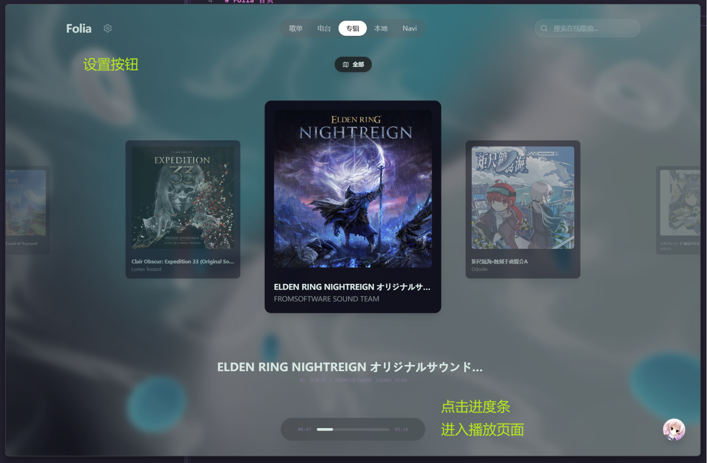

Folia里所有的 歌曲集合/歌单/专辑 都作为卡片展示，点击卡片即可进入海报墙页面。

点击顶部的 **全部** 按钮，可以快速查看当前视图下的全部卡片

## 海报墙

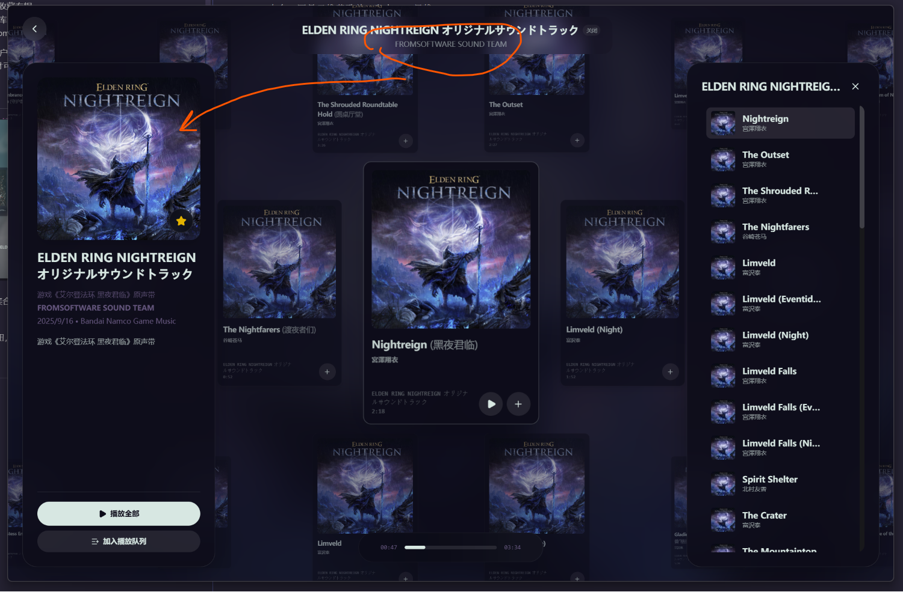

点击顶部可以展开左侧面板，查看当前歌单/专辑信息。

点击右侧按钮，会打开歌曲列表，快速定位歌曲。

整个歌曲列表海报墙可以使用鼠标/滚轮/触控拖动，点击歌曲可以聚焦到当前。

在该页面按下任意按键，即可触发搜索过滤，过滤出来的结果可以快速添加到播放队列：

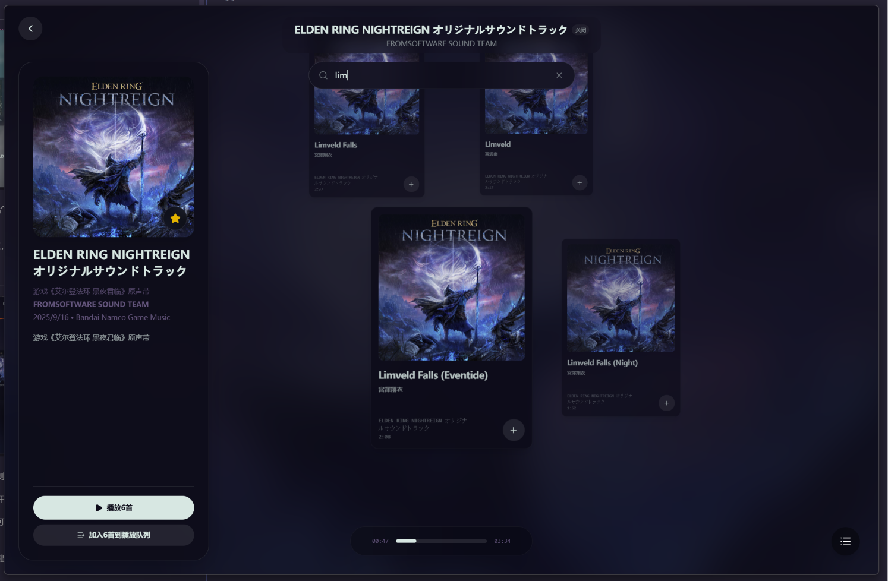

# 播放页面

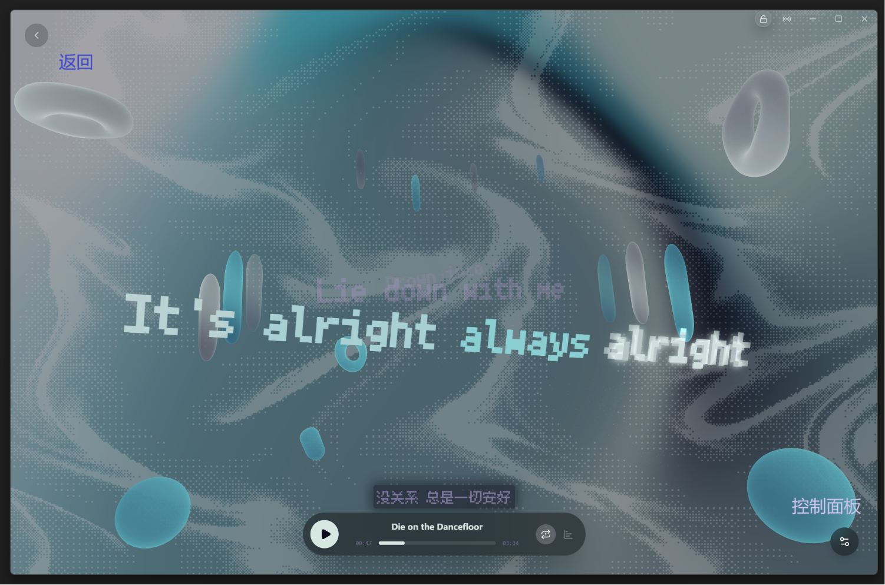

播放页面左上角悬浮鼠标，可以快速返回。

右下角按钮可以展开控制面板：

中间一排图标从左到右，分别是：

## 歌曲信息

展示当前播放歌曲标题，专辑，艺术家信息，点击对应条目可以跳转

## 歌词信息

当前播放歌曲的歌词信息，可以发起在线歌词匹配，本地歌词文件导入，歌词时间轴调整

## 播放控制

主要控制功能。

第一行按钮的功能分别为：循环模式，添加到我喜欢的歌曲，进行AI主题生成

AI主题生成按钮在当前歌曲已有主题的情况下，会显示为：

没有的时候，显示为：

下方可以调整当前播放页面的背景，主题以及相关的简单设置。点击齿轮按钮则可以打开完整的歌词样式设置

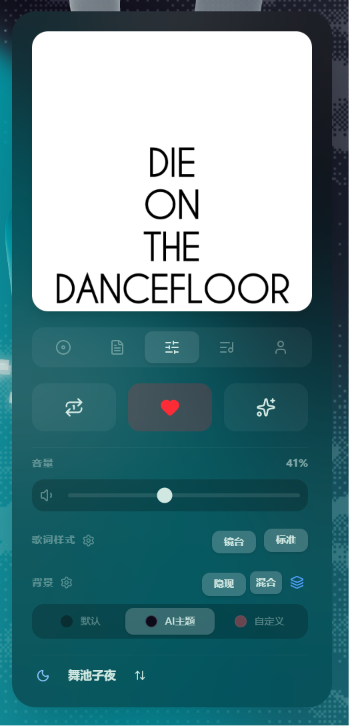

如果生成过AI主题，点击主题名，即可打开快速主题编辑面板：

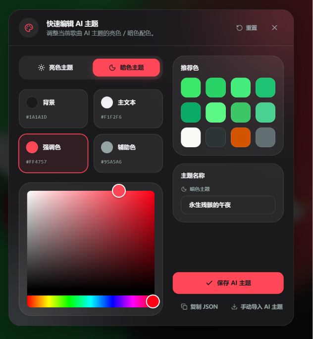

关于如何使用ai主题功能，请跳到 [AI 主题功能快速上手](/guide/basic#ai-主题功能快速上手)。

## 播放队列

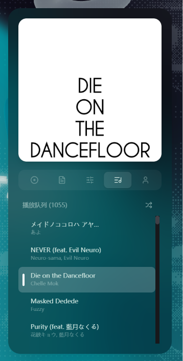

鼠标悬浮在播放队列的歌曲上，可以调整播放顺序：

三个按钮分别是：移动到下一首，移动到末尾，移除播放列表

## 账户信息

当前登录的网易云账户信息，以及播放音质选择

# S命令窗口

按下 S键，或者滑动右侧按钮，可以打开命令窗口：

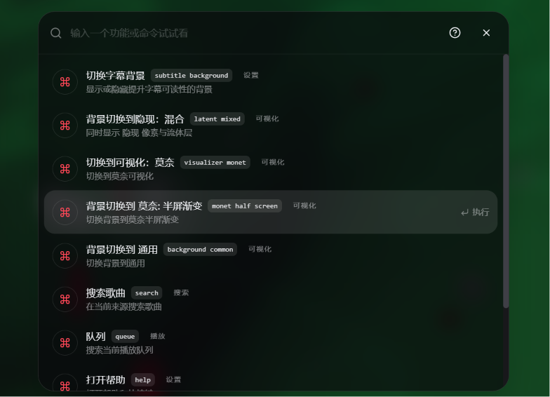

绝大多数功能都可以在这里直接执行，可以输入中文，英文，拼音。具体命令可点击问号按钮查看

# AI 主题功能快速上手

简单来说，AI主题功能会使用当前播放歌曲的歌词内容，生成一个配色主题。该功能要求你必须自己提供一个AI服务的API Key，Folia本身不提供任何AI服务。

当没有接入任何AI服务时，点击生成AI主题功能按钮，会回退到使用封面取色方案，产出一个主题。你可以在快速主题编辑器里修改这个主题。

## 如何配置AI 服务

首先你需要拥有任意一个大模型厂商的API Key，例如：Gemini，OpenAI，DeepSeek，Kimi等。查阅对应模型厂商的文档，获取API Key，以及调用该模型的接口地址和模型名。

下面以 DeepSeek 为例说明一下

你需要在 DeepSeek 的官网注册账号，然后找到其[开放文档](https://api-docs.deepseek.com/zh-cn/)，在其中找到 `OpenAI 兼容接口`的部分，记下来其中的 `接口地址`，`模型名`：

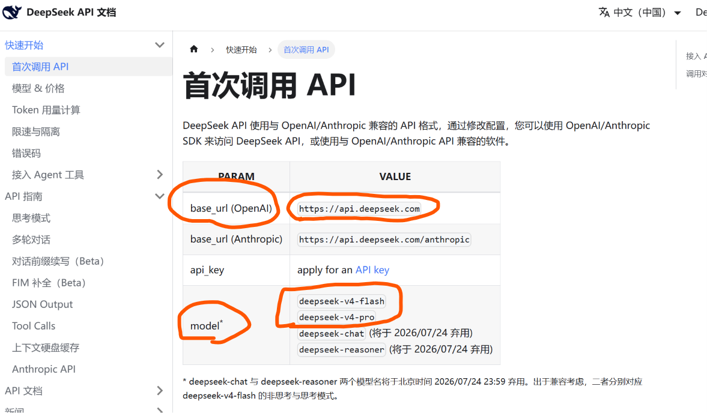

这里的接口地址是 `https://api.deepseek.com`, 模型名是 `deepseek-v4-flash` 或 `deepseek-v4-pro` 

然后打开 https://platform.deepseek.com/api_keys ,点击创建 一个新的API Key：

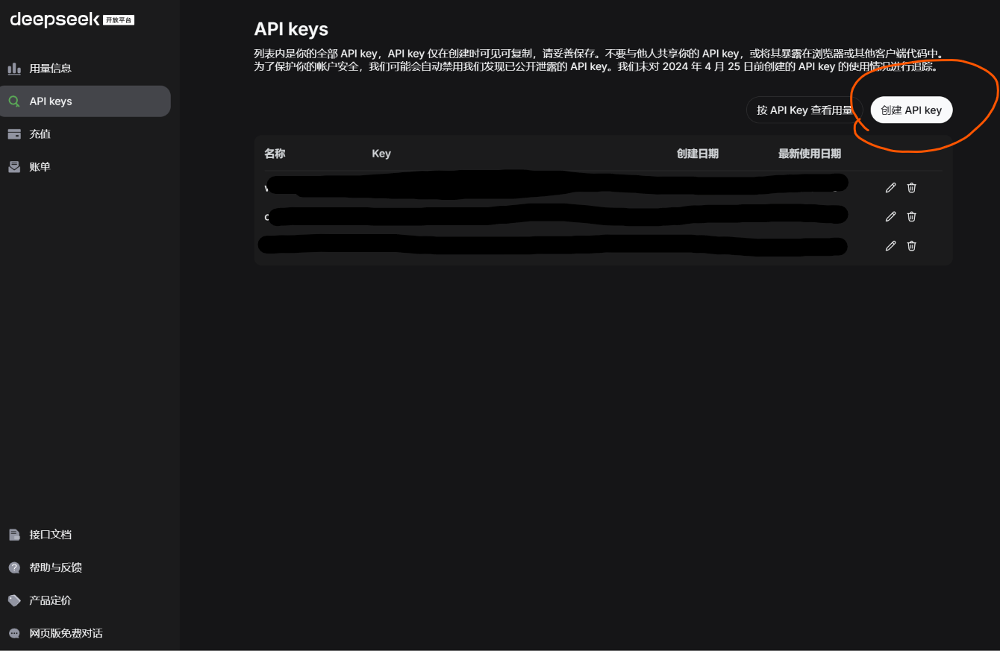

然后保存这个API Key，回到 Folia 的设置里，找到 AI 主题设置，填写对应的 API Key，接口地址和模型名。

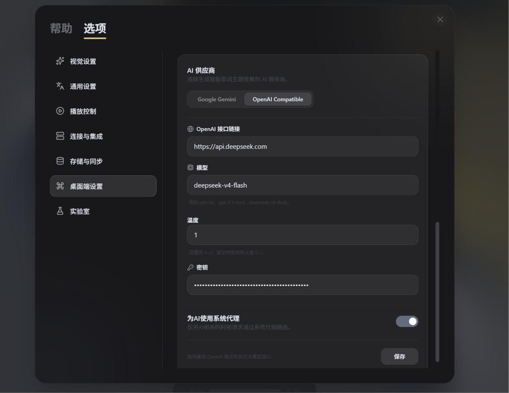

如果你使用的是其他厂商的服务，查阅对应厂商的文档，获取API Key，接口地址和模型名，然后在 Folia 的设置里填写。

> [!TIP]
> 如果你使用的是国外厂商的服务，可以打开 为AI使用系统代理，这会让 Folia 使用系统代理访问AI服务，避免网络问题导致的请求失败。

配置完成之后，点击生成AI主题按钮，就可以使用AI服务生成主题了。详见这个[演示视频](https://www.bilibili.com/video/BV1zcTj6AEpu/)