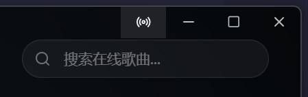
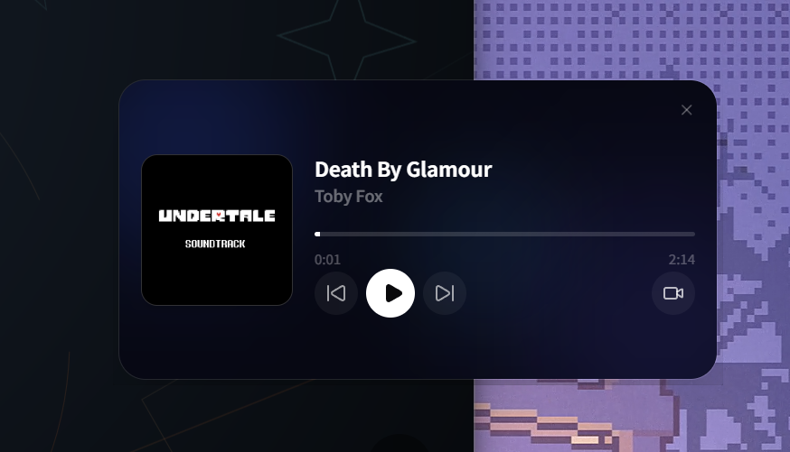
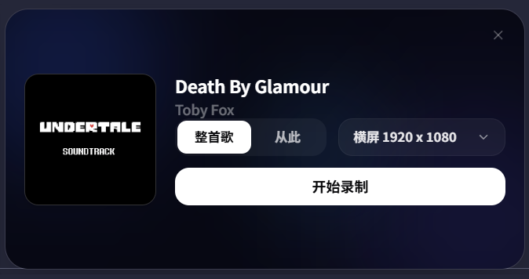

# 桌面版功能

桌面版是 Folia 功能最完整的形态。除了播放器本体外，还集成了本地 API、遥控窗、视频导出、更新检查和系统级窗口能力。

## 适合谁

- 想开箱即用，不想自己部署 Web 版
- 想使用 Stage API、遥控窗、视频录制
- 想获得更稳定的本地文件访问和缓存能力

## 遥控窗

桌面版可以点击标题栏左侧按钮打开一个独立的 `Folia Remote` 小窗，用来控制当前播放。



可用能力：

- 播放 / 暂停
- 上一首 / 下一首
- 拖动进度条跳转
- 打开[视频录制面板](/guide/desktop#视频录制)



### Hyprland 提示

Hyprland 上默认情况下就可以以浮窗的形式打开遥控窗，为实现最佳效果，建议添加如下配置到 `hyprland.conf`

```ini
windowrule {
  name = folia-remote
  float = on
  size = 520 315
  center = on
  pin = on
  no_blur = on
  border_size = 0
  no_shadow = on
  match:class = ^(folia-major)$
  match:title = ^(Folia Remote)$
}
```

## 视频录制

桌面版支持把主播放窗口录制成 WebM 视频。

目前内置的导出预设为：

- `1280 x 720`
- `1920 x 1080`
- `2560 x 1440`

使用方式：

1. 打开遥控窗。
2. 点击视频按钮。
3. 选择录制尺寸。
4. 选择从整首歌开始，或从当前进度开始。
5. 开始录制，结束后保存为 `.webm` 文件。

录制时主窗口会被临时调整到目标分辨率，结束后会自动恢复。

这个录制本身是通过捕获主窗口的画面并编码成视频实现的，实际上效果并不会比使用屏幕录制软件更好，甚至可能更差（尤其在高分辨率下）。如果你需要更高质量的视频，建议直接使用OBS等专业的屏幕录制软件捕获主窗口。

## Stage Mode

桌面版可以在设置中开启 Stage Mode。开启后可以选择：

### Stage API 模式
- 启动本地 `Stage API`
- 生成 Bearer Token
- 允许外部工具向 Folia 推送歌词、媒体会话或点歌请求

### NOW PLAYING 模式
- 对接 [Now Playing](https://github.com/Widdit/now-playing-service) 服务
- 让Now Playing 将支持的播放器的播放状态，歌词，时间信息传递给 folia，进行歌词动画展示

更多见 [Stage 与 Now Playing](/guide/stage-and-now-playing) 和 [Stage API](/developer/stage-api)。

## 更新与系统集成

桌面版还包含这些增强能力：

- Windows 任务栏播放按钮
- 应用内检查更新
- 自动下载更新（支持的平台上）
- 本地音频缓存目录管理

## 什么时候不要选桌面版

以下情况更适合 Web 版：

- 你只想在浏览器里临时体验
- 你希望手机和平板也能直接访问
- 你更偏好把服务部署在自己的服务器上
