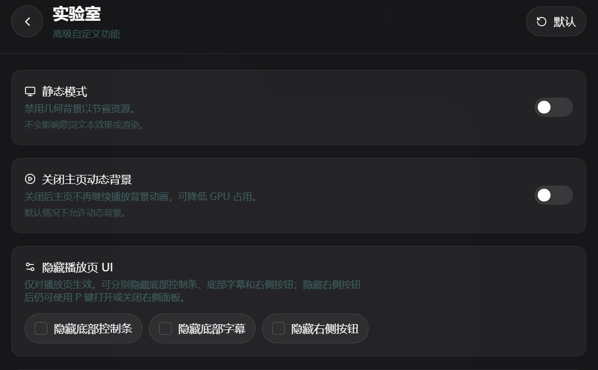
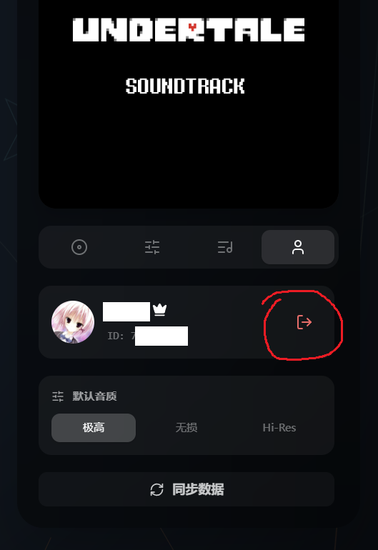
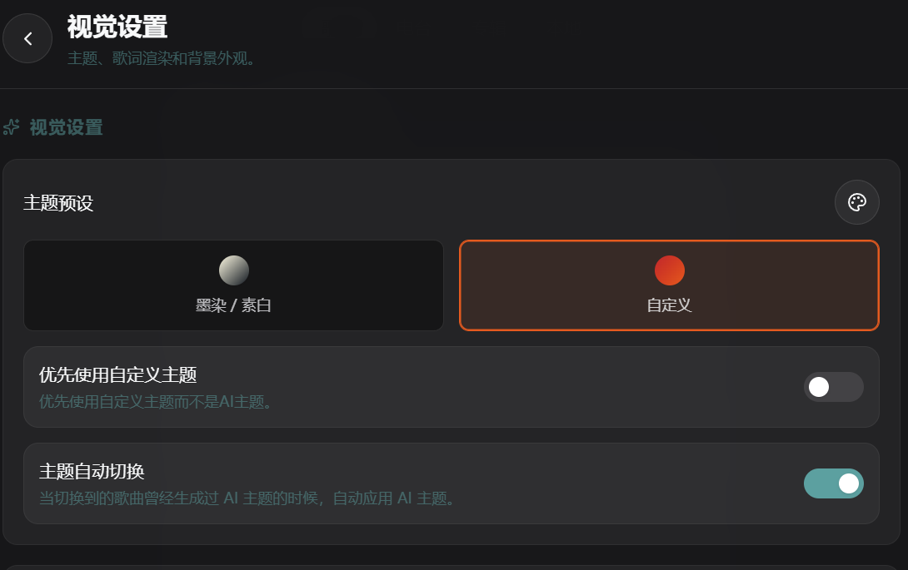
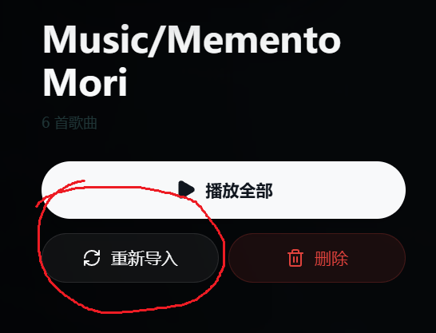
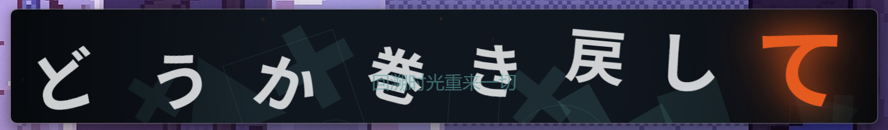
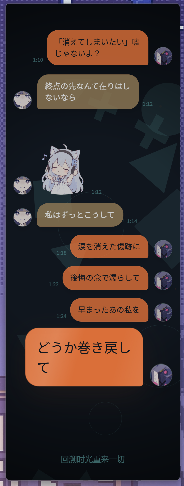
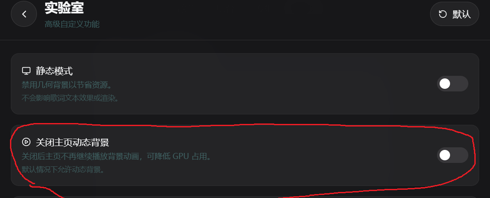

> [!TIP] 本页的内容太多了！
> 如果你想快速找到某个问题的答案，可以按 `Ctrl + F` 搜索关键词，或者将这个页面的地址发送给AI，让他们帮你找到对应的解答。

# 常见问题

这页主要整理主项目里最常见的问题

## 怎么全屏/怎么隐藏进度条/怎么隐藏下面的翻译/怎么隐藏右边按钮

按 `F11` 可以切换全屏模式，再按一次 `F11` 可以退出全屏。

按 `H` 可以切换隐藏进度条和右边按钮，再按一次 `H` 可以切换回来。

你还可以在高级自定义设置里找到更多选项，来调整界面显示：




## 为什么大量的歌曲都显示为已下架无法播放

原因是没有登录网易云账户，或者登陆状态失效了（即使右下角显示已登录，有用户头像等信息，实际上登录状态可能已经过期了）。



点击退出登录，然后重新扫码登陆一次，一般就可以解决了。


## 为什么我能打开播放器，但搜不到歌

最常见原因是 `网易云 API` 没有配置好，或者 API 地址本身不可访问。

首先检查是否是登录状态失效（即使右下角显示已登录，实际上登录状态可能已经过期了）。退出登录，然后重新扫码登陆一次。如果不是登录状态问题，再检查：

1. 是否已经正确填写 `VITE_NETEASE_API_BASE`
2. 这个地址能否直接在浏览器里打开
3. 你部署的是 Web 版还是桌面版
4. 你部署的网易云 API 是否额外配置了 `ENABLE_GENERAL_UNBLOCK=false`

如果你部署的是 Web 版，建议先按 [部署 Web 版](/guide/deploy-vercel) 先把前端和网易云 API 都部署好，再回头排查搜索问题。

## 为什么点了 AI 主题按钮之后，下一首歌也会用上一次的 AI 主题？或者我切歌的时候突然发现颜色变了，但我明明没有点 AI 主题按钮？

先说结论：很多时候这不是bug，而是当前设计就是这样。

AI 主题的行为大致是：

1. 如果你已经配置 AI 接口，点击 AI 主题按钮时，会把当前歌曲歌词发给模型，让模型返回一套主题配置
2. 这套配置同时包含浅色和深色主题
3. 以后切歌时，如果新歌曲以前生成过 AI 主题，就会切到那首歌对应的主题
4. 如果新歌曲从来没生成过 AI 主题，就会继续沿用你上一次正在使用的 AI 主题

这意味着：它并不是“每切一首歌都自动重新请求一次 AI 并生成全新主题”。只有你主动为某首歌生成过主题，后续切回这首歌时才会自动切过去。

如果你没有配置 AI API，也不是完全不能用。当前实现仍然会在你点击按钮时做一次主题生成，只是这时走的是退化方案：从封面取色，再结合内置主题生成一套结果。想让颜色重新变化，需要你再点一次按钮。

在设置中可以更改这个行为，停止自动切换主题：



更多说明见 [AI 主题](/guide/ai-theme)。

## 为什么播放的时候会突然卡住，所有动画都不动，过一会就好了，尤其是拖动进度条的时候

优先检查本地歌曲播放的时候是否存在相同问题，如果本地歌曲没有问题，优先怀疑网络问题导致的音频文件缓冲不顺畅。

由于歌曲动画等时间相关的操作，依赖于当前音频的播放时钟来驱动，如果网络问题导致音频文件缓冲不顺畅，卡住了，那么动画也会跟着卡住。
这个问题常见于本地开了科学上网工具的情况，网易云的音频文件是流式传输的，如果走了全局代理导致网络延迟，就会出现这种卡顿。

## 为什么手机浏览器里打开后界面显示不正常，或者部分功能无法使用

1. 请检查是否使用的是 Chrome for Android 或者 iOS 18 以上版本的 Safari，其他浏览器可能(非常可能！) 存在兼容性问题
2. 文件系统访问功能在移动端浏览器里的支持有限，经测试目前只有 Chrome for Android 支持，iOS 上的 Safari 目前不支持这个功能，所以在 iOS 的移动浏览器里无法使用本地音乐相关的功能
3. 音频设备访问，本机字体访问这些功能在移动端上也都无法保证能用

## 为什么本地音乐没有歌词

按顺序检查：

1. 音频旁边是否存在同名 `.lrc` 或 `.vtt`
2. 音频文件里是否内嵌了歌词
3. 你是否手动触发过在线匹配
4. 当前歌词来源是否被切到了别的来源

如果你导入的是整批本地音乐，建议搭配 [本地音乐](/guide/local-music) 一起看。

## 为什么每次重新打开都要重新授权本地音乐目录

1. 先确认你是否已经更新到较新的版本
2. 再确认导入后的音乐目录有没有被移动、重命名、换盘，或者权限被系统回收

如果更新后仍能稳定复现，再带着版本号和复现步骤去提 issue，会更容易定位。

## 为什么本地音乐明明还在，却提示要重新授权，或者就是播不了

如果你遇到的是“列表里还有歌，但播不了”，通常优先怀疑：

- 文件访问权限失效
- 文件路径变了，比如移动了文件、重命名了文件
- 索引还在，但实际文件句柄已经失效

最直接的处理方式是打开那个文件夹，点击重新导入：



## Navidrome 连接测试失败怎么办

优先检查：

- `Server URL` 能否从当前设备直接访问
- 用户名和密码是否正确
- 是否有反向代理、HTTPS、跨域或端口转发问题
- Navidrome 服务本身是否正在运行

Web 部署版本的 Folia 需要连接公网地址的 Navidrome 实例。如果你的 Navidrome 实例在内网，建议使用桌面版 Folia 来连接。

## Now Playing 连接不上怎么办

Folia 连接的是本机 `Now Playing` 服务的默认ws端口：

```text
ws://localhost:9863/api/ws/lyric
```

先确认本机对应服务已经启动，再检查：

- `9863` 端口是否被占用或被拦截
- 防火墙或安全软件是否阻止了本地 WebSocket
- 你是否在本机环境里运行，而不是跨机器连接


## Stage API 返回 401

这通常说明 `Bearer Token` 没带上，或者你复制的是旧 Token。

按这个顺序查：

1. 在桌面版设置里重新复制 Token
2. 检查请求头是否为 `Authorization: Bearer <token>`
3. 如果你改过设置或重装过应用，重新生成或重新复制一次

## 为什么 Web 版没有应用内视频录制

这是平台能力差异，Web版本没有这个功能。

桌面版可以做更完整的窗口采集、遥控窗和本地集成，所以有些能力只会放在桌面端。Web 版一般需要改用浏览器录屏、系统录屏或 OBS。

实际上桌面版的内置录制功能也是通过捕获主窗口的画面并编码成视频实现的，建议直接使用OBS等专业的屏幕录制软件捕获主窗口/浏览器。

## 为什么有些歌曲会灰掉、卡住，或者不能播放

这通常和歌曲本身已下架、资源不可用，或者上游接口拿不到可播放链接有关。

Folia 的处理逻辑大致是：

1. 不可用歌曲会被标成不可用或直接灰掉
2. 你单独点击一首不可用歌曲时，如果系统能找到可替代的版本，会先弹窗问你要不要播放替代版本
3. 如果你确认，就会按替代版本建队列并播放
4. 如果找不到替代版本，会提示不可播放，然后不继续
5. 如果你点的是“播放全部”，构建播放队列时会直接跳过不可用歌曲

## 为什么界面在高缩放、小窗口或高 DPI 下显示不正常

主页面推荐的最低可用视口大约是 `800 x 600`

如果低于这个范围，某些元素可能互相挤压，例如播放列表标题可能被进度条挡住。这是小视口下的已知限制，建议尽量保持窗口尺寸不低于这个范围。

但是实际上界面是支持响应式布局的，一些极端尺寸下的显示效果可能比较有趣：





建议先尝试：

1. 浏览器缩放恢复到 `100%`
2. 把系统缩放改到常见比例后复现
3. 尽量保证窗口尺寸不低于 `800 x 600`

## 为什么风扇转得快，或者首页 GPU 占用偏高

首页背景里的动态几何图形，再叠加模糊等视觉效果，会给 GPU 带来额外压力。

如果你觉得机器负担偏高，可以优先尝试：

1. 到高级自定义设置里关闭 **主页动态背景**



这会在返回主页的情况下停止背景动画渲染，视觉效果影响不是特别大

2. 在性能较弱的设备上优先使用更轻量级的动画效果

## 为什么网页和桌面版显示效果、功能不完全一样

这是正常的。

Folia 的 Web 版和桌面版共享了很多核心逻辑，但仍有一部分功能依赖桌面运行时，所以一部分功能只会出现在桌面端，例如：

- 遥控窗
- 更完整的 Stage / Now Playing 集成
- 应用内视频相关能力
- 某些本地媒体和系统层交互

另外，不同平台的字体、渲染、窗口能力不同，视觉细节略有差异也属于正常现象。

