# 本地音乐

Folia 可以直接扫描本机音乐文件，在浏览器或桌面端建立本地曲库。在不上传任何音频文件的前提下，帮助你管理歌曲、文件夹、艺术家、专辑、歌单、歌词和封面。

## 1. 导入与更新音乐

### 导入文件夹
建议直接导入包含音乐的整个文件夹（支持子目录递归扫描）：
1. 在 Folia 首页找到“本地音乐”区域，点击“导入文件夹”。
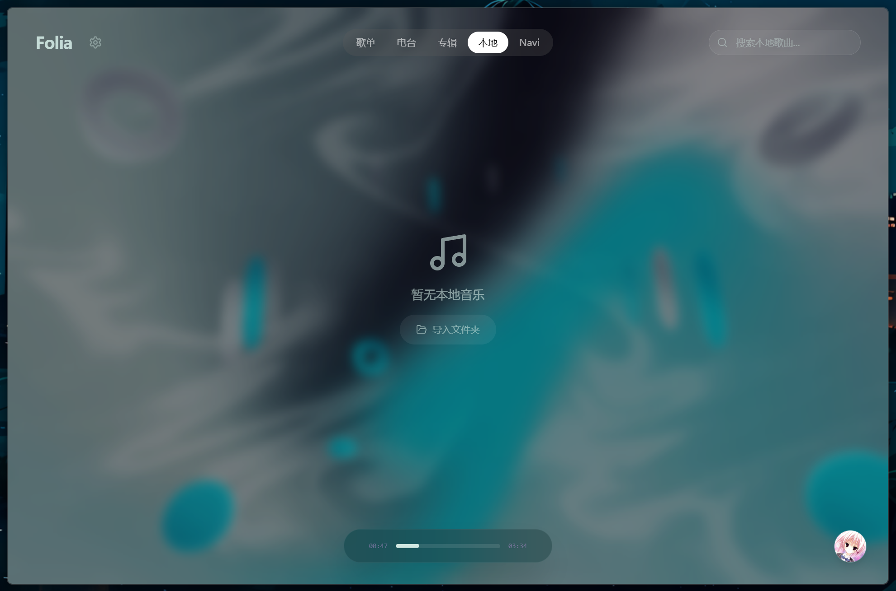
2. 在系统弹窗中选择你的音乐目录。
3. 等待扫描完成即可。

> **提示**：网页版的文件夹导入依赖浏览器的文件系统访问功能（File System Access API）。如果页面提示不支持，请使用最新版的 Chrome / Edge 浏览器，或者直接使用 Folia 桌面版。

### 重扫与恢复访问
如果音乐文件发生了增、删、改，只需在对应集合操作中选择**重新导入**。Folia 会进行快速的增量扫描，复用未变更的信息，并且保留你已经手动修改过的歌曲信息。

出于安全原因，浏览器或系统重启后可能会收回目录的访问权限。如果提示“需要恢复本地音乐访问权限”，按照界面提示重新授权即可。

## 2. 支持的文件与格式

### 音频格式
Folia 支持常见的音频格式：`mp3`、`flac`、`m4a`、`wav`、`ogg`、`opus`、`aac`。
导入时，Folia 会自动读取音频标签（标题、艺术家、专辑、时长、封面等）。如果没有标签，会尝试从文件名中提取信息。

### 歌词
Folia 会自动识别**音频内嵌歌词**，以及与音频同目录、基础文件名相同的歌词文件。
- **支持格式**：`.lrc`、`.vtt`、`.ttml`、`.qrc`、`.yrc`、`.krc`。
- **命名规则**：如歌曲叫 `track.mp3`，歌词可以是 `track.lrc` 或 `track.mp3.lrc`。
- **翻译歌词**：支持使用 `.t.lrc` 或 `.t.vtt`（如 `track.t.lrc`）作为独立的翻译歌词文件。

> 如果同一首歌存在多个格式的歌词，Folia 的优先顺序为：LRC、VTT、TTML、QRC、YRC、KRC。你也可以在播放音乐时，在右侧面板的“本地”选项卡中随时切换本地歌词、内嵌歌词或在线匹配歌词。
> 
> *进阶提示：Folia 的歌词解析器完美兼容各种逐字高亮时间轴格式（如增强 LRC 的尖括号或方括号标签），推荐使用诸如 LDDC 等工具来制作你的逐字歌词。*

### 封面文件
如果你希望整个文件夹使用同一张封面，可以在目录中放置：
- `cover.png`
- `cover.jpg` 或 `cover.jpeg`

文件夹封面的优先级会高于音频自身自带的内嵌封面。

## 3. 整理你的音乐库

Folia 为本地音乐提供了丰富的整理功能

> [!WARNING]
> **你在 Folia 中对歌曲信息所做的任何修改，都不会改写电脑上的歌曲源文件**
> Folia 的元数据信息存储于应用/浏览器的本地数据库中，而不会重新写入到歌曲文件内部。如果你想要修改歌曲文件本身的内嵌元数据，请使用专用的元数据编辑工具，如 MusicBrainz Picard、Mp3tag 等。

> [!INFO]
> **使用更好的内嵌元数据**
> 虽然你可以通过 Folia 自动补全本地歌曲的信息，但更合理的做法是使用专用的元数据编辑工具来编辑本地歌曲的内嵌元数据，然后再导入 Folia。这样可以避免 Folia 无法识别的格式，编码错误等导致的问题。


### 补全歌曲信息

歌曲导入的时候，会读取内嵌元数据信息，并在播放的时候进行在线匹配，补全歌曲的封面、歌词、艺术家、专辑。如果你觉得自动补全的信息不准确，也可以手动修改。

此外，在本地歌曲的文件夹视图中，可以对文件夹中的歌曲批量运行自动匹配：

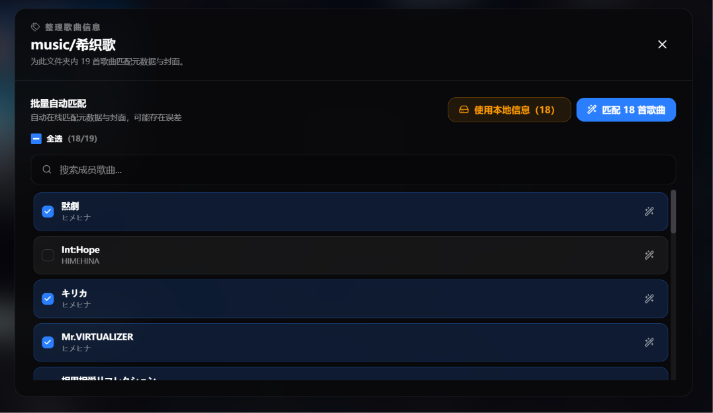

自动匹配使用与播放时相同的在线匹配逻辑，一般情况下你不需要对匹配到的信息进行修改。如果某些歌曲的匹配信息有错误，可以点击歌曲卡片标题附近的铅笔按钮（鼠标悬停触发），手动进行匹配修正：

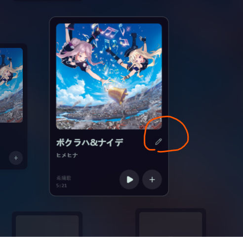
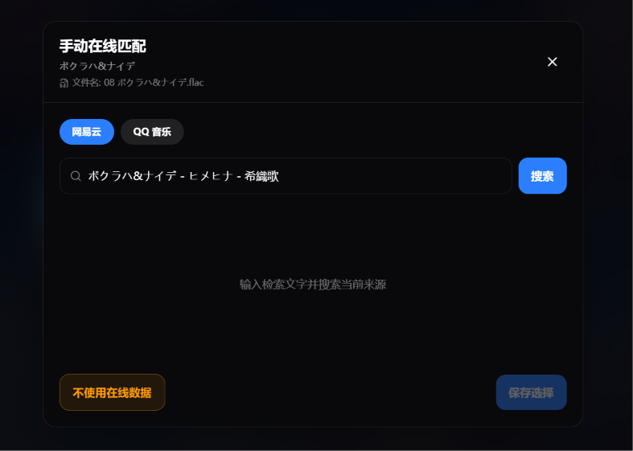

此外，你也可以选择 **不使用在线数据** ，这种情况下会清除掉在线匹配结果，并仅使用此歌曲的内嵌元数据信息

## 4. 管理音乐库的歌手，专辑信息

### 实体、歌曲与元数据

为解决本地歌曲的信息与在线匹配信息可能存在的冲突问题，Folia 为本地歌曲引入了 **实体** 的概念：

- **歌曲（Track）**：代表硬盘上的单个音频文件。歌曲携带了本地文件导入时刻的元数据。
- **实体（Entity）**：代表一个唯一可识别的**艺术家**或**专辑**

一个**歌曲**可以指向一个**专辑实体**，以及多个**艺术家实体**

**实体**内部是一组聚合在一起的元数据信息，举例来说，如果硬盘上存在如下三个音乐文件：

```
- QUEEN - A Kind of Magic.flac
- QUEEN - One Year of Love.flac
- QUEEN - One Vision.flac
```

歌曲导入，以及自动匹配发生的时候，解析器尝试合并简单的格式差异。但歌曲的内嵌元数据存在错误，或者自动在线匹配时，各个平台给出不一致的元数据，会导致歌曲的元信息产生差异：

```
- QUEEN - A Kind of Magic.flac
    - 艺术家：Queen
    - 专辑：A Kind of Magic(1991)
    - 歌曲：A Kind of Magic

- QUEEN - One Year of Love.flac
    - 艺术家：皇后乐队(Queen)
    - 专辑：A Kind of Magic
    - 歌曲：One Year of Love

- QUEEN - One Vision.flac
    - 艺术家：John Deacon
    - 专辑：最新热门摇滚
    - 歌曲：One Vision

```

上述三个文件，虽然都来自 Queen 的专辑，但在导入 Folia 后，会为它们创建独立的艺术家和专辑记录：

```
- 艺术家实体 1：
  - 名称：Queen
  - 歌曲数量：1
  - 描述：Queen (1991)

- 艺术家实体 2：
  - 名称：皇后乐队(Queen)
  - 歌曲数量：1
  - 描述：皇后乐队(Queen)

- 艺术家实体 3：
  - 名称：John Deacon
  - 歌曲数量：1
  - 描述：John Deacon

- 专辑实体 1：
  - 名称：A Kind of Magic(1991)
  - 歌曲数量：1

- 专辑实体 2：
  - 名称：A Kind of Magic
  - 歌曲数量：1

- 专辑实体 3：
  - 名称：最新热门摇滚
  - 歌曲数量：1
```

当同一歌手因为名字拼写不同被识别成了两个，或者一首歌被分错了专辑，你可以打开相应的歌手或专辑页面，点击上方标题，在右侧弹出面板中点击信息按钮进行调整：

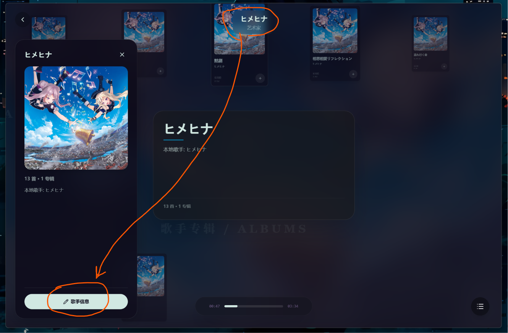

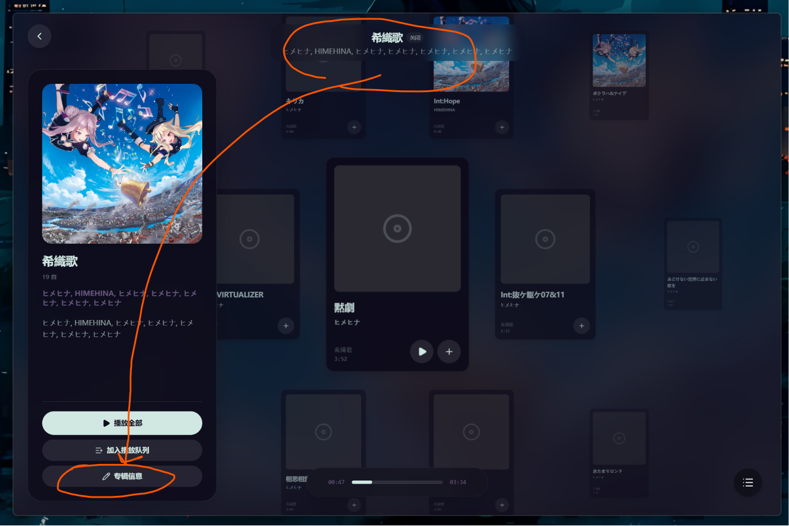

具体的操作方式：

#### **合并实体**

将两个同类实体合并为一个，所有连接的歌曲都将合并到目标实体中。

例子:

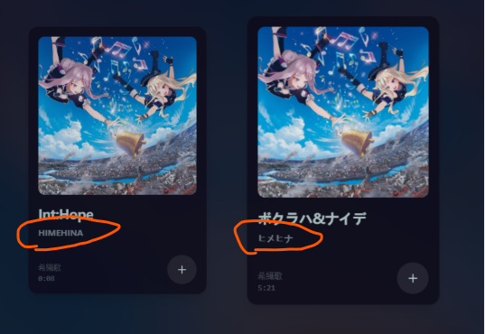

这里两首歌的艺术家分别连接了两个不同的实体：`HIMEHINA` 与 `ヒメヒナ`, 实际上应该是同一艺术家的不同拼写方式。

我们打开其中任意一个艺术家页面，进入信息编辑：

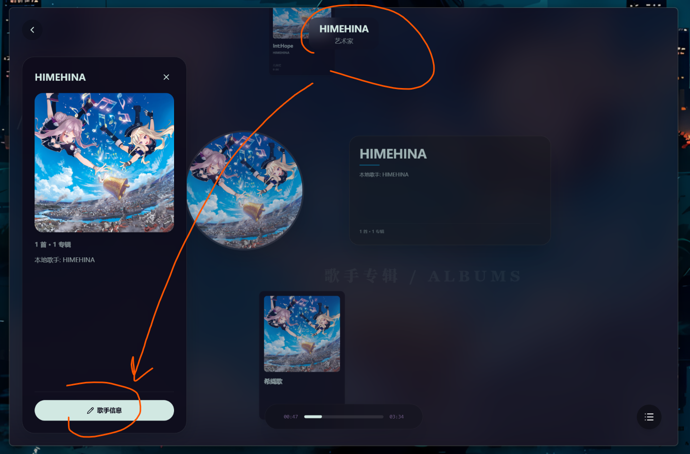

打开的窗口中，在搜索框中输入`ヒメヒナ`, 然后点击对应条目，即可进入合并阶段。

中间的箭头表示了合并方向，这里我们将`ヒメヒナ`合并到`HIMEHINA`中，原有的`ヒメヒナ`实体将会被删除，所有曾经连接到`ヒメヒナ`的歌曲，都会被重新连接到`HIMEHINA`。

点击提交按钮，即可完成合并。

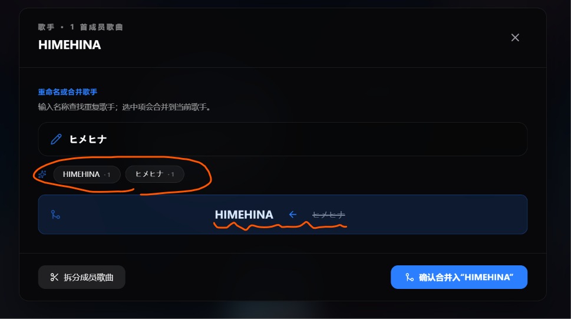

#### **修改实体显示名**

有些情况下，实体合并之后的显示名称并不是你想要的样子，例如：

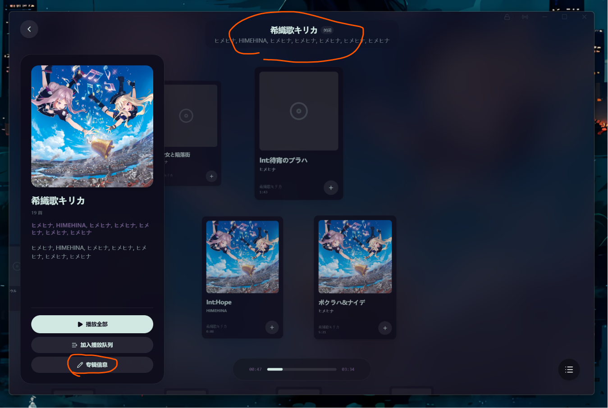

我们希望这里能展示为 "キリカ"，此时同样可以打开信息编辑，然后输入 "キリカ"，并确认重命名

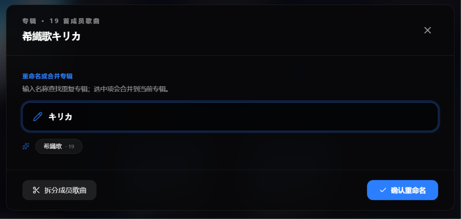

信息面板会记录这个实体之前的曾用名，从而便于切换。

#### **拆分实体**

有的时候歌曲会被错误归类到同一个实体内部，例如 `热门歌曲` 等错误专辑信息，此时可以在信息面板中选择拆分歌曲：

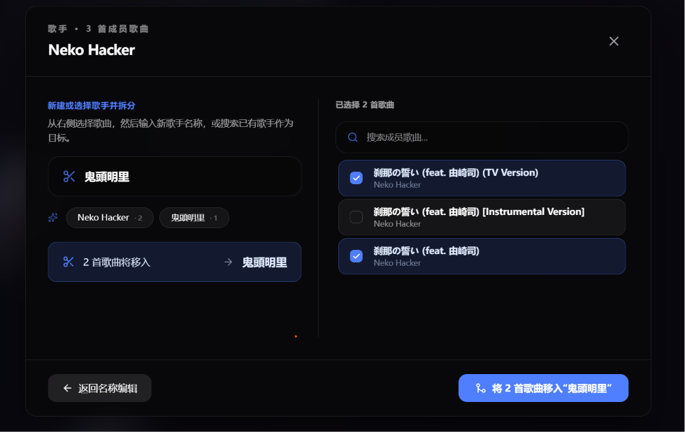

为歌曲选择或输入正确的信息，即可将其转移到已有的正确实体中。

此操作最好在已经有正确产生的实体的情况下进行，例如同一专辑已经在库中有正确的专辑实体，但其中某一首歌曲未被纳入的时候。

### 歌单管理

本地歌曲可以加入 Folia 的自定义歌单中。歌单只保存歌曲的“引用”，不复制或移动你的文件。如果电脑上的文件被删除，歌单中的条目也会相应失效。


## 4. 常见问题 (FAQ)

- **导入按钮为什么不可用？**
  当前浏览器不支持文件夹导入。请改用 Chrome、Edge 浏览器，或使用 Folia 桌面版。
- **重启后无法播放本地歌曲？**
  请点击界面的提示重新授权文件夹访问权限。如果你的文件夹被移动或改名了，重新导入该文件夹即可。
- **整理歌曲信息会下载歌词吗？**
  不会。“整理歌曲信息”主要处理歌名、歌手和封面。
  
  歌词会在你播放这首歌时，根据你的匹配策略动态获取并缓存。
- **在 Folia 里删除文件夹，会把我电脑里的文件删掉吗？**
  不会。所有操作只影响 Folia 内部的曲库记录，绝不会碰触或删除你硬盘上的本地文件。
