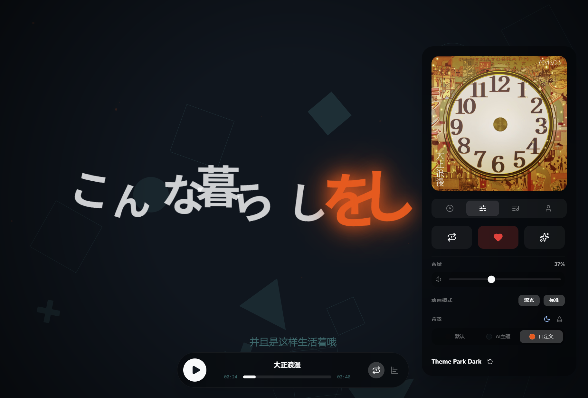

# 播放、歌词与视觉模式

Folia 的核心体验在播放页。歌词、封面、节奏和背景会一起组成主要界面，播放页本身就是它最有代表性的体验之一。

::: tip Folia 有两个播放视图
本文讲的是`可视化`播放页——专注当前这一首，13 种歌词动画加各种背景。另一个是 [Lattice（队列拼贴）](/guide/lattice)，把整条队列铺成海报墙。点击播放后进入哪个可以在`设置 > 选项 > 界面设置 > 播放后进入的视图`里选，也可以随时用 <kbd>Ctrl/Cmd</kbd> + <kbd>B</kbd> 互相切换。
:::

## 播放页里有什么

播放页通常包含这些区域：

- 当前歌曲信息：标题、歌手、专辑、封面
- 主歌词区域：逐行或逐字推进的歌词动画
- 底部控制：播放、暂停、切歌、进度、音量
- 右侧面板：主题、歌词来源、视觉模式、AI 主题、循环等设置

如果你在桌面版里启用了某些实验设置，部分控件还可以被自动隐藏，让画面更干净。

## 歌词如何显示

Folia 会把来自不同来源的歌词整理成统一时间轴，再交给 visualizer 渲染。你看到的差异，主要来自渲染模式和歌词数据质量，而不是播放器本身的不同页面。

### 常见歌词能力

- 逐行歌词
- 逐字歌词
- 翻译字幕
- 下一句提示
- 情感词或关键词着色
- 适配不同语言和不同切分粒度的布局

项目代码里已经兼容或识别多种歌词来源与格式，包括：

- `lrc`
- `enhanced-lrc`（LDDC 等工具生成的增强型逐字歌词）
- `yrc`
- `qrc`
- `krc`
- `vtt`
- `ttml`（含 AMLL TTML 逐词歌词库）
- `awlrc` 容器（保留逐字时序、翻译与罗马音轨道）
- OpenSubsonic 结构化歌词（Navidrome v0.63+ 的逐字时间轴）
- 音频标签中的内嵌歌词
- 同目录歌词文件

## 内置视觉模式

当前内置模式包括：

- `静止`：不渲染动画和背景，资源占用最低。
- `流光`：默认模式，适合绝大多数歌曲，观感稳定。
- `心象`：更强调情绪氛围、层次和封面意象。
- `云阶`：更偏结构化排版和段落推进感。
- `浮名`：镜头感更强，几何背景和景深存在感更明显。
- `莫奈`：强调肖像、封面、背景构图和副歌意象，适合做更强的视觉展示。
- `群唱`：把歌词做成消息流/角色演出式效果，支持表情包和头像玩法。
- `倾诉`：更强调逐字呼吸、旋转与句内动态。
- `回环`：歌词沿倾斜轨道环绕推进，聚焦句居中放大。
- `镜台`：三维点云场景，镜头在粒子空间中穿行，歌词带跟唱特效。
- `时计`：钟表机械式画面，歌词绕轮盘转动，可显示表盘封面。
- `商籁`：偏平面设计与排版构成，带场景转场和整体后处理滤镜。
- `凝彩`：使用大面积色块、网点和反色文字组成 PV 式画面，并支持管理自己的图片池。

这些模式共享同一套播放数据，但布局、镜头语言和调参项完全不同。

## 视觉模式不是只能切换，还能细调

在设置中心的视觉设置里，你可以继续进入更细的动画调整面板。代码层面这些模式都带有各自的 tuning，常见可调范围包括：

- 字体与字号比例
- 背景透明度和视觉层权重
- 几何背景是否启用
- 某个模式的镜头速度、停留强度、布局风格
- 自定义表情包、头像包、背景图或肖像图

如果你只是想选一种风格，用预设就够了；如果你想拿它做录屏、展示或桌面美化，再去细调会更有价值。

如果你想了解每个调节项分别会影响什么效果，可以继续看 [歌词动画参数说明](/guide/lyrics-animation-tuning)。

## 主题、背景与歌词之间的关系

播放页最终效果通常由三层共同决定：

1. 主题来源
2. 歌词动画模式
3. 背景呈现方式

### 主题来源

- 默认主题
- AI 主题
- 自定义主题

### 常见背景能力

- 封面主色参与背景配色
- 透明播放页背景
- 自动隐藏控制栏
- URL Background：把外部网页作为最底层背景嵌入
- 某些模式使用封面、上传图片或肖像图参与构图

如果开启“歌曲主题自动切换”，切歌时会优先恢复这首歌上一次生成或保存过的主题。

## 歌词来源优先级

不同歌曲来源下，Folia 会使用不同的歌词来源策略。

### 在线歌曲

- 优先从在线接口读取歌词
- 常见情况下能直接拿到逐行或逐字歌词
- 如果打开了`自动使用最佳歌词`，还会检索 AMLLDB、QQ、酷狗等备选来源做比较

### 本地歌曲

本地音乐常见优先级通常是：

1. 同目录同名歌词文件
2. 音频内嵌歌词
3. 在线匹配歌词

这个顺序可以在 `设置 > 选项 > 播放控制 > 本地歌曲歌词优先级` 里改成`在线优先`；手动指定过来源的歌曲不受影响。

如果自动结果不理想，可以在播放页右侧面板手动指定来源，或只保留本地信息。

### 服务器歌曲（Navidrome / OpenSubsonic）

- 优先使用服务端返回的歌词
- Navidrome v0.63+ 会通过 OpenSubsonic 的 `songLyrics` 暴露逐字时间轴，Folia 会完整解析
- 也可以切换到在线匹配结果
- 如果你很在意歌词质量，建议配合“自动使用最佳歌词”一起使用

详见 [Navidrome / OpenSubsonic](/guide/navidrome)。

## 播放控制与展示控制

右侧面板和底部控制会覆盖这几类高频动作：

- 循环模式：关闭 / 列表循环 / 单曲循环
- 播放与暂停
- 进度拖动
- 音量与静音
- 歌词来源切换
- 视觉模式切换

部分设置还能进一步影响“展示感”：

- 隐藏底部控制条
- 隐藏翻译字幕
- 隐藏右侧按钮
- 自动隐藏控制栏
- 启用透明背景或 OBS 接入

### 关于上一首 / 下一首

底部控制条默认不常驻切歌按钮。想要它们，有三种办法：

1. **快捷键**：`Ctrl/Cmd + ←/→`，或命令面板的执行模式 <kbd>:</kbd> <kbd>N</kbd> / <kbd>:</kbd> <kbd>B</kbd>。
2. **进度条按钮槽位**：`设置 > 选项 > 界面设置 > 底部界面 > 进度条按钮槽位`，把其中一个槽位设成`上一首`或`下一首`。
3. **始终显示切歌箭头**：`设置 > 选项 > 实验室`，让进度条标题两侧的箭头常驻，不再需要悬停才浮出。

系统媒体控制（任务栏 / 通知中心 / 蓝牙耳机按键）也一直可用。

## 适合录屏、投屏和直播的组合

如果你想把 Folia 当作展示工具，比较实用的组合是：

- 先选定一个视觉模式
- 为歌曲生成 AI 主题，或导入自己的主题配置
- 在实验性设置中精简 UI
- 桌面版配合遥控窗操作
- 需要直播时改用 OBS Browser Source
- 需要外部联动时启用 Stage API 或 Now Playing

这样做的好处是：主画面可以尽量干净，控制操作则放到旁边的小窗或外部工具里。
